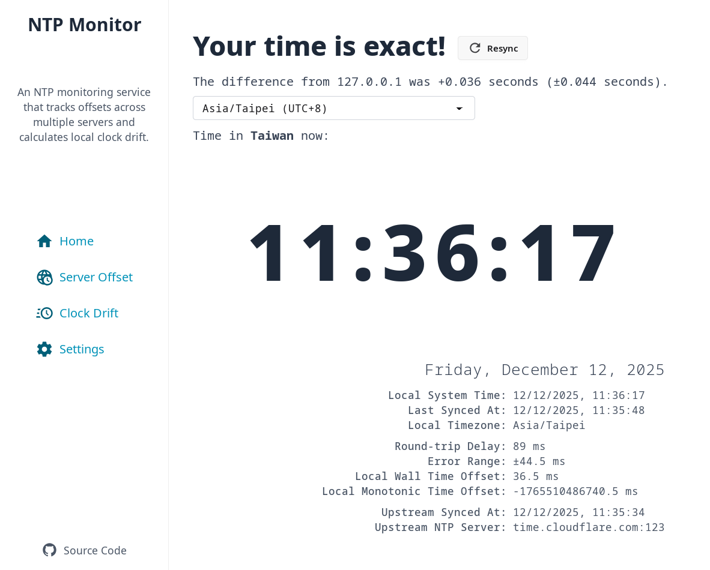
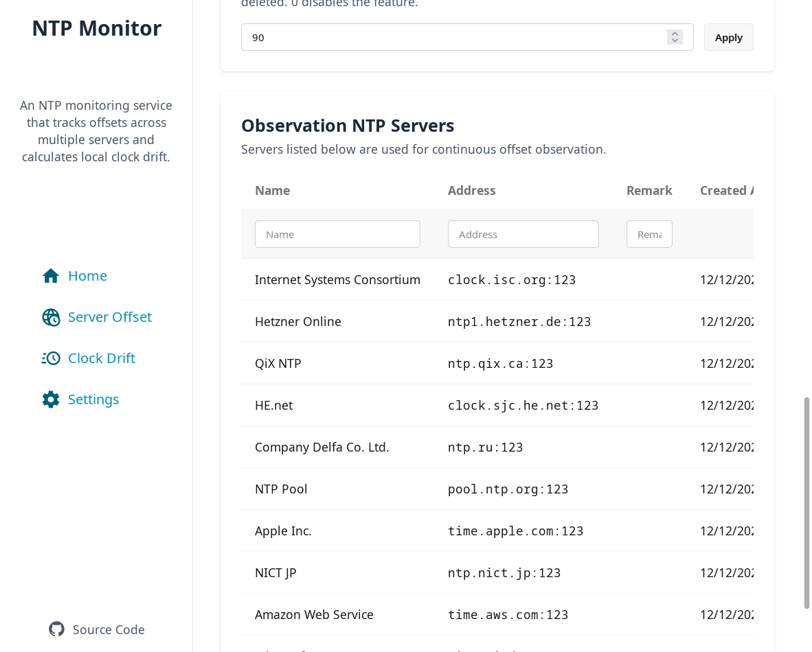
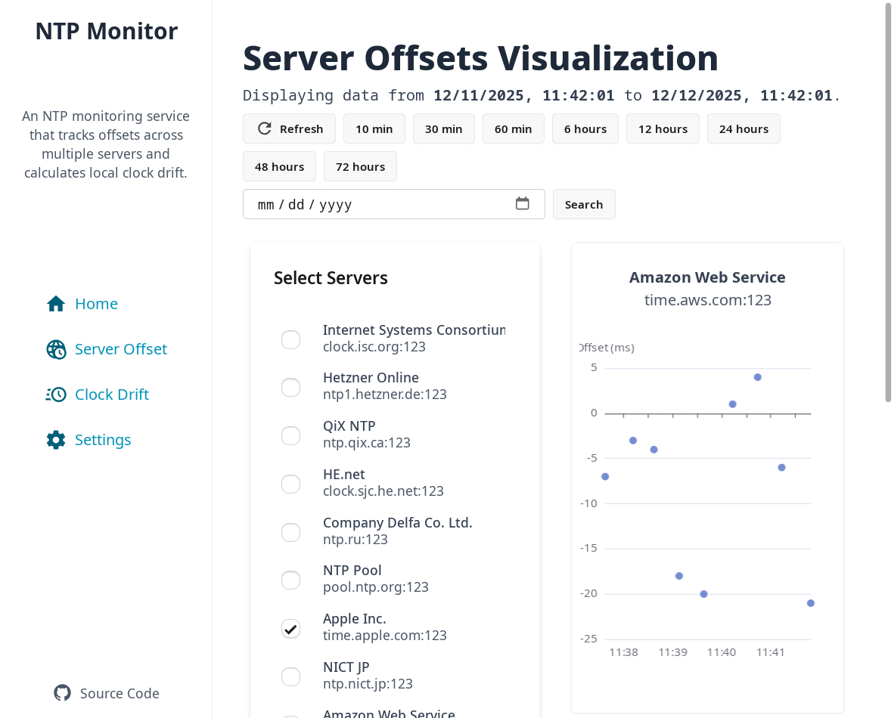
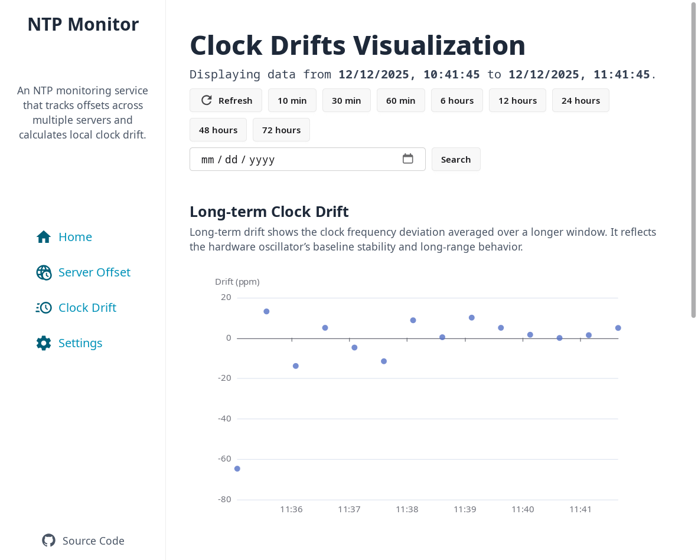

# NTP Monitor

**NTP Monitor** is a tool for measuring, monitoring, and analyzing local clock drifts and NTP offsets of remote servers. It provides both CLI and web-based interfaces for real-time visualization of time synchronization data.

Key features:

- **Offset Measurement:** Uses a reference NTP server to calculate offsets between the reference and monitored servers, allowing precise evaluation of clock accuracy and network-induced delays.
- **Drift Analysis:** Tracks local clock drift over time to detect anomalies or degradation in timekeeping performance.
- **Real-Time Visualization:** Web interface displays offset and drift data, supporting trend analysis and anomaly detection.
- **High-Precision Local Time Check:** Implements functionality similar to _time.is_, providing accurate measurement of the deviation between the local system clock and standard time, with improved precision.

## Before you get started

Before using **NTP Monitor**, you should have:

1. UDP access to the NTP servers.
2. A working Go environment (for building from source) if you do not use precompiled binaries.

## Installing `ntpmonitor`

NTP Monitor can be installed via precompiled binaries, or built from source:

- **Precompiled binaries**: Available on the [releases page](https://github.com/bclswl0827/ntpmonitor/releases).
- **Docker image**: [ghcr.io/bclswl0827/ntpmonitor](https://github.com/bclswl0827/ntpmonitor/pkgs/container/ntpmonitor)
- **Build from source**:

  ```bash
  git clone https://github.com/bclswl0827/ntpmonitor.git
  cd ntpmonitor
  make
  ```

- **Dependencies**: Go >= 1.25.4

After installation, you can run `ntpmonitor --help` to see all available commands and options.

## CLI Usage

```
Usage of /ntpmonitor:
  -database string
        Path to database file (will be created if not exists) (default "./states.db")
  -listen string
        Listen address for web interface (default "0.0.0.0:6060")
  -log-level string
        Log level [info|warn|error] (default "info")
  -password string
        Password for changing user settings (default "ntpmonitor-admin")
```

- `-database` : path to the SQLite database to store measurement logs.
- `-listen` : address and port for the web interface.
- `-log-level` : logging verbosity.
- `-password` : admin password for changing user settings via web interface.

**It's strongly recommended to change the default password.**

## Measuring and monitoring NTP offsets

Once installed, you can start monitoring NTP servers:

### Start the web interface

```bash
ntpmonitor -password <your-admin-password>
```

It launches the web UI and begins monitoring. By default, it listens on `0.0.0.0:6060` and stores data in `./states.db`. You can open the web interface in a browser to see current time, real-time server offsets, and clock drifts.

### Perform Browser Time Check

Upon opening the homepage, the web interface automatically compares the local browser time against the reference time to measure user-end clock offset.



### Add Observation Servers

Go to the **Settings** page, log in, and add NTP servers to monitor.



### Wait for Results

After a few minutes to several hours, the measured offsets for each monitored NTP server will be displayed.



### Analyzing Clock Drifts

Clock drift analysis is divided into **Long-term Clock Drift** and **Short-term Clock Drift**:

- **Long-term Drift:** Shows the clock frequency deviation averaged over a longer period. This reflects the baseline stability of the hardware oscillator and its long-term behavior.
- **Short-term Drift:** Captures rapid frequency fluctuations over a short period, representing short-timescale jitter or variations caused by temperature changes.


